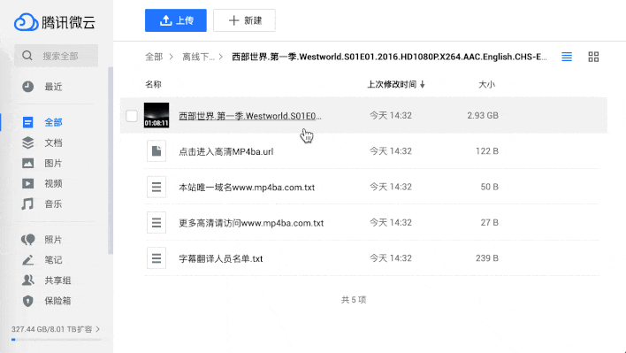
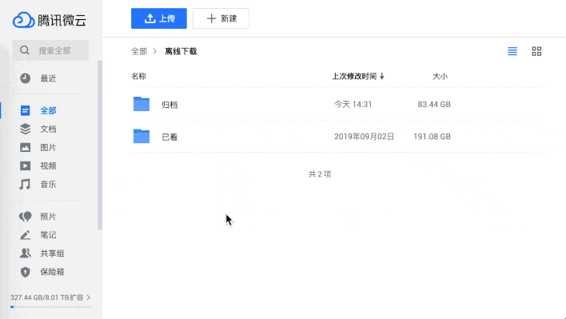

# WeiyunHelper

WeiyunHelper 是微云的辅助脚本，拥有以下功能：

- [x] 🔗 下载文件时支持通过 AriaNg 下载
- [x] 🧲 支持粘贴自动（快捷）下载磁力链链接
- [x] 🎊 同时支持个人文件管理页和分享页的 AriaNG 下载
- [ ] 💡 你有什么[想法](https://github.com/loo2k/WeiyunHelper/issues)？

## 如何使用

使用前需要先安装 [Tampermonkey](https://chrome.google.com/webstore/detail/tampermonkey/dhdgffkkebhmkfjojejmpbldmpobfkfo) 扩展，安装完成后访问下方的安装地址：

👉🏼 [https://greasyfork.org/zh-CN/scripts/402669-weiyunhelper](https://greasyfork.org/zh-CN/scripts/402669-weiyunhelper)

### 配置 AriaNg

因为目前没有直接调用 Aria2 的接口，依赖了 AriaNg 的服务。所以需要使用的用户使用 [http://ariang.mayswind.net/latest/](http://ariang.mayswind.net/latest/) 进行对应的设置后使用。

如果你希望支持直接调用 Aria2 的接口也可以发起 PR 贡献你的代码 :)

## 功能概览

**🔗 下载文件时支持通过 AriaNg 下载**

**🧲 支持粘贴自动（快捷）下载磁力链链接**

## 声明

WeiyunHelper 仅供个人学习交流，严禁用于商业用途。
